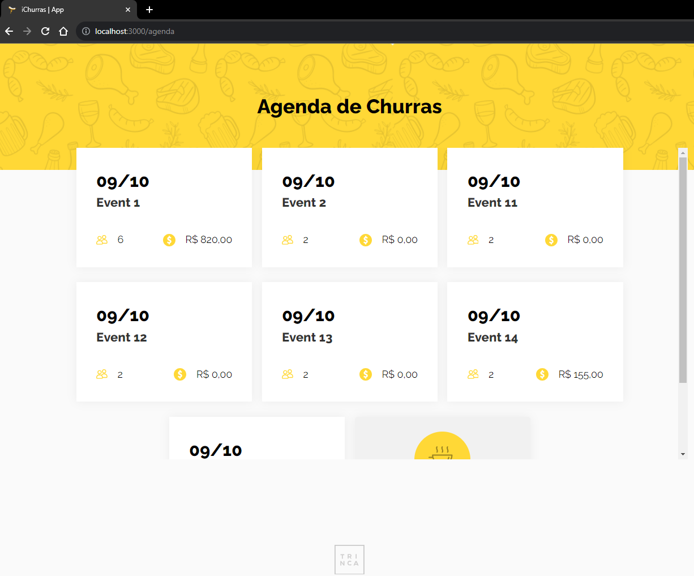

<div style="display: flex; align-items: center;justify-content: center">
    
    <p style="font-size: 4rem">iChurras</p>
</div>

<h1 align='center'>A agenda de churras da Galera 🍻</h1>

<div align="center" style="margin-top: 30px;">
    <a href="https://pt-br.reactjs.org/docs/getting-started.html" target="_blank"  rel="noopener noreferrer">
         &nbsp;&nbsp;
    <a href="https://nextjs.org/docs/getting-started" target="_blank"  rel="noopener noreferrer" >
        
    </a>&nbsp;&nbsp;
     <a href="https://www.typescriptlang.org/" target="_blank"  rel="noopener noreferrer" >
        
    </a>&nbsp;&nbsp;
     <a href="https://tailwindcss.com/" target="_blank"  rel="noopener noreferrer" >
        
    </a>&nbsp;&nbsp;
</div>

# iChurras

Projeto como POC para uma agenda de eventos, voltada especialmente para colaboração
financeira de membros



# :notebook: Sobre

Projeto contruído em Next 13, atualmente com dados em Mock, salvo em memória (LocalStorage).
Funções implmementadas apenas do gerenciamento pagamentos sobre eventos já criados.

# :hammer: Technologies

#### 📃 Dependencies: -> <i><kbd> [package.json](./package.json) </kbd></i>

- [x] <b>[React Js](https://reactjs.org/);
- [x] <b>[Typescript](https://www.typescriptlang.org/);
- [x] <b>[Next Js](https://nextjs.org/docs):
- [x] <b>[Tailwind CSS](https://tailwindcss.com/):

Proto: [Figma](https://www.figma.com/file/dCOCULjQiBYMJFmEQsTGNrzS/Churras-Trinca?type=design&node-id=0-1&mode=design)

This is a [Next.js](https://nextjs.org/) project bootstrapped with [`create-next-app`](https://github.com/vercel/next.js/tree/canary/packages/create-next-app).

## Getting Started

First, run the development server:

```bash
npm run dev
# or
yarn dev
# or
pnpm dev
# or
bun dev
```

Open [http://localhost:3000](http://localhost:3000) with your browser to see the result.

This project uses [`next/font`](https://nextjs.org/docs/basic-features/font-optimization) to automatically optimize and load, a custom Google Font.
